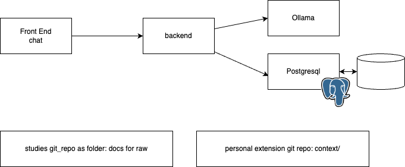
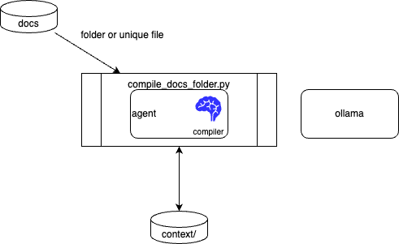
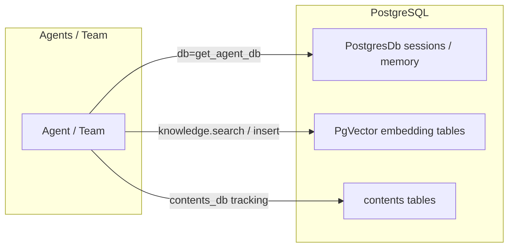
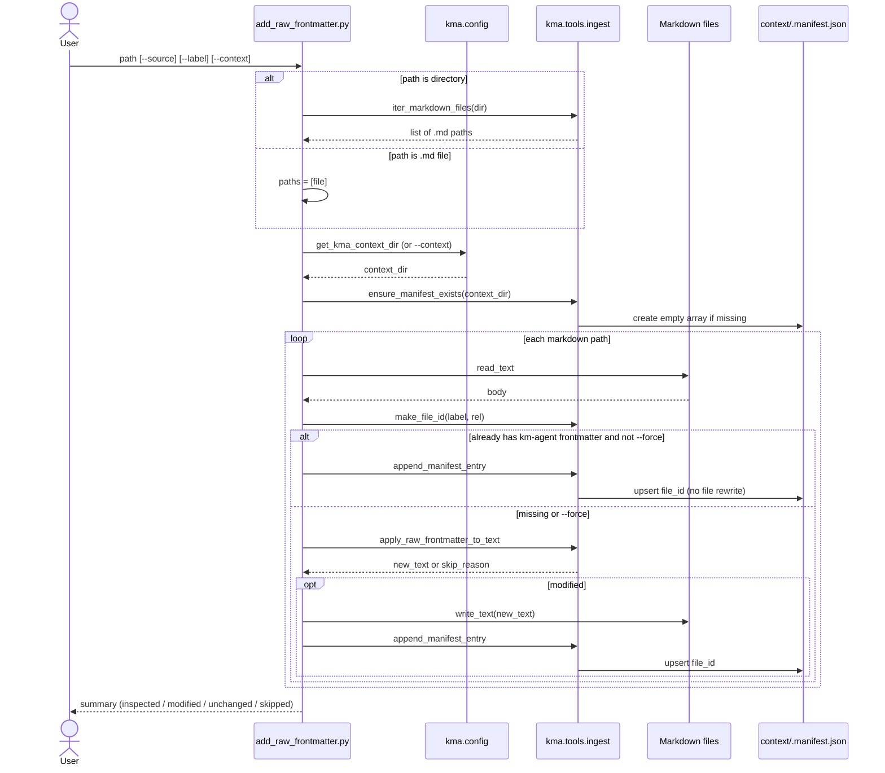
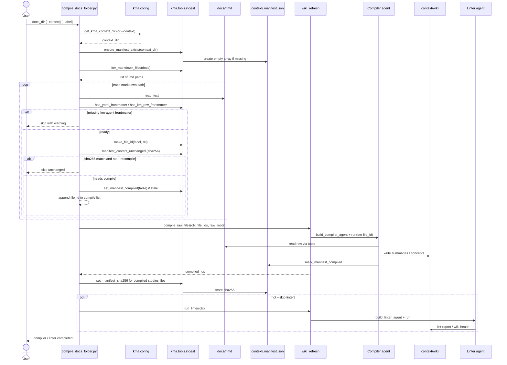
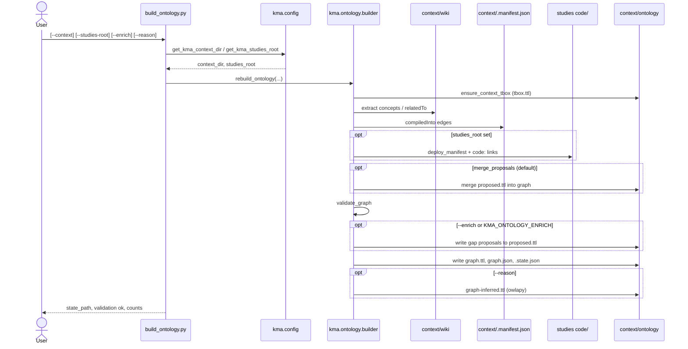
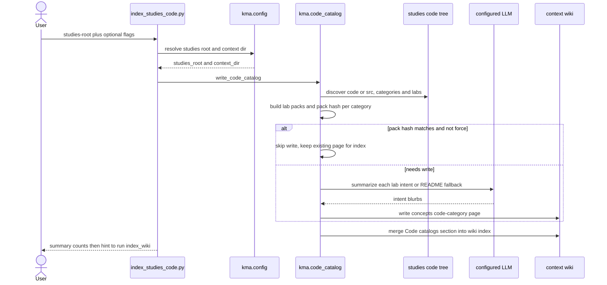
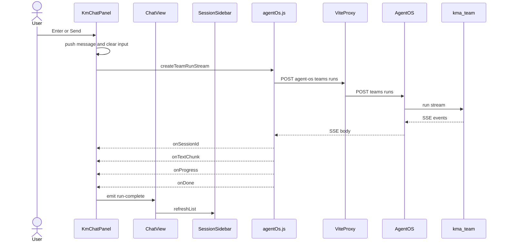

# Developer practices

???- info "version"
    - Created 02/2026
    - Update with new refactoring 07/2026
    
This chapter is for developer willing to work on this code base.

## Solution Architecture

<figure markdown='span'>
{ width=800 }
<caption>Figure 1: km-agent components</caption>
</figure>

## Code structure

The code of the solution is under `src/`:

```
src/
├── app/                 # ASGI entry: AgentOS + optional static UI
│   ├── config.yaml      # Chat default queries
│   └── main.py
├── frontend/            # Vue chat UI — see [frontend/README.md](https://github.com/jbcodeforce/km-agent/tree/
main/src/frontend/README.md)
└── kma/                 # Backend package: agents, tools, DB, ontology
    ├── agents/
    ├── tools/           # see [tools/README.md](https://github.com/jbcodeforce/km-agent/tree/
main/src/kma/tools/README.md)
    ├── workflows/
    ├── ontology/
    ├── embeddings/
    ├── db.py
    ├── llm_factory.py
    └── config.py
```

## Design

As illustrated in figure above, there are 4 mains components to address the different use cases of the platform:

1. User interface to chat with agent
1. Agent components exposed as REST APIs
1. Postgresql database and vector database to keep agent information. The database schema is defined by the agno persistence layer to keep learning and user queries history.
1. Tools to help manage content directly without frontend.

### Agents

When the user interacts with the chat UI ([`agentOs.js`](https://github.com/jbcodeforce/km-agent/tree/
main/src/frontend/src/services/agentOs.js)), requests go to the coordinating team (`kma_team`), which routes work to member agents.

#### Backend organization

The app in [`src/app/main.py`](https://github.com/jbcodeforce/km-agent/tree/
main/src/app/main.py) builds an Agno `AgentOS` with the team, individual agents (so each can be invoked over HTTP as well as inside the team), and Knowledge vector stores. Agent definitions and shared infrastructure live under `src/kma/`.

```sh
src/
├── app/
│   ├── main.py            # AgentOS FastAPI app; teams, agents, knowledge, POST /kma/save-raw
│   └── config.yaml        # Chat default queries
└── kma/
    ├── config.py          # Env vars, context dir, feature flags
    ├── db.py              # PostgresDb + Knowledge factory
    ├── llm_factory.py     # Chat Model construction (ollama, mlx, openai, …)
    ├── code_catalog.py    # Code index helpers
    ├── agents/
    │   ├── team.py        # kma_team coordinator (routes to members)
    │   ├── navigator.py   # Wiki / SQL / file Q&A
    │   ├── researcher.py  # Web search + ingest to raw/
    │   ├── compiler.py    # raw/ → wiki/ articles
    │   ├── linter.py      # Wiki health / integrity
    │   ├── settings.py    # Cached agent_db + kma_knowledge / learnings / wiki
    │   └── instructions.py
    ├── tools/             # @tool implementations; per-agent bundles in builder.py
    ├── workflows/         # Background wiki refresh, enrichment
    ├── ontology/          # Graph extract / merge / validate / retrieval
    ├── embeddings/        # Local embedders (fastembed, mlx)
    └── models/            # Extra model adapters
```

| Layer | Role |
|-------|------|
| `app/main.py` | Wires AgentOS: `get_kma_team()`, individual agents, knowledge bases, optional static UI, `POST /kma/save-raw`. |
| `kma/agents/team.py` | Team leader: routes chat to Navigator / Researcher / Compiler / Linter; can call `trigger_wiki_refresh`. |
| `kma/agents/{navigator,researcher,compiler,linter}.py` | Factories (`get_*` / `build_*`) that construct Agno `Agent` instances with model, tools, and knowledge. |
| `kma/agents/settings.py` | Lazy-cached `PostgresDb` and Knowledge stores shared across agents (`get_agent_db`, `get_kma_knowledge`, …). |
| `kma/tools/builder.py` | Assembles per-agent tool lists (`build_compiler_tools`, `build_navigator_tools`, …). |
| `kma/db.py` + `llm_factory.py` | Persistence (`get_postgres_db`, `create_knowledge`) and chat model providers (`build_default_llm_model`). |
| `kma/workflows/` | Non-chat pipelines (e.g. background compile + lint after research ingest). |
| `kma/ontology/` | Wiki ontology graph construction and tools used by Navigator. |

Types named `Agent`, `Team`, `Knowledge`, `PostgresDb`, and `Model` come from the Agno library; `navigator`, `compiler`, `researcher`, and `linter` are the concrete agent instances built in `src/kma/agents/`. Tool lists are assembled in `kma.tools.builder` and delegate to `compiler_fs`, `ingest`, `wiki`, `knowledge`, and Agno helpers (`FileTools`, `SQLTools`, …).

#### Member agents

* [Team](https://github.com/jbcodeforce/km-agent/tree/main/src/kma/agents/team.py) — chat entrypoint; delegates to members below.
* [Navigator](https://github.com/jbcodeforce/km-agent/tree/main/src/kma/agents/navigator.py) — primary user-facing agent for wiki Q&A, SQL, and files.
* [Researcher](https://github.com/jbcodeforce/km-agent/tree/main/src/kma/agents/researcher.py) — web search and ingest into `raw/` (does not answer users directly).
* [Compiler](https://github.com/jbcodeforce/km-agent/tree/main/src/kma/agents/compiler.py) — indexes raw data into wiki articles. Used by the docs crawler and callable via `build_compiler_agent()`. Example: indexing an existing docs folder:

  

* [Linter](https://github.com/jbcodeforce/km-agent/tree/main/src/kma/agents/linter.py) — keeps integrity within the wiki content and proposes research follow-ups.

#### Agent Structure

Each agent is an Agno [`Agent`](https://docs.agno.com/) (the team is an Agno `Team`) built by a factory in `src/kma/agents/`. Factories share the same wiring pattern; members differ mainly in instructions, tools, and whether learning / session history is enabled.

##### Generic construction

```python
Agent(
    id="…",
    name="…",
    role="…",
    model=build_default_llm_model(),   # kma.llm_factory
    db=get_agent_db(),                 # shared PostgresDb (sessions / memory)
    instructions="…",                  # system prompt
    knowledge=get_kma_knowledge(),     # Agno Knowledge (vector + contents)
    search_knowledge=True|False,       # expose search_knowledge tool
    tools=[…],                         # from kma.tools.builder
    # optional on Navigator / Team:
    learning=LearningMachine(...),     # agentic learnings store
    enable_agentic_memory=True,
    search_past_sessions=True,
    add_history_to_context=True,
    …
)
```

| Piece | Source | Purpose |
|-------|--------|---------|
| `model` | `kma.llm_factory.build_default_llm_model()` | Chat LLM (`KMA_LLM_PROVIDER` / model id). |
| `db` | `kma.agents.settings.get_agent_db()` → `kma.db.get_postgres_db()` | Agno session storage, chat history, agentic memory. |
| `knowledge` | `get_kma_knowledge()` (or override) | Retrievable metadata index; `search_knowledge` when enabled. |
| `tools` | `kma.tools.builder.build_*_tools(...)` | File/wiki/ingest/SQL/ontology tools; often includes `update_knowledge`. |
| `learning` | `LearningMachine` + `LearnedKnowledgeConfig(mode=AGENTIC)` | Only on **Navigator** and **Team** today — agent decides when to `search_learnings` / `save_learning`. |

| Agent / Team | `knowledge` | `search_knowledge` | `learning` | Session history |
|--------------|-------------|--------------------|------------|-----------------|
| Team (`kma`) | used by `LearningMachine` (`kma_knowledge`) | — | yes (`AGENTIC`) | yes |
| Navigator | `kma_knowledge` (+ `search_wiki` on `kma_wiki`) | yes | yes → `kma_learnings` | yes |
| Compiler | `kma_knowledge` | yes | no | no |
| Linter | `kma_knowledge` | yes | no | no |
| Researcher | `kma_knowledge` | no | no | no |

##### Knowledge vs learnings

km-agent keeps **three** Agno `Knowledge` bases (created in [`settings.py`](https://github.com/jbcodeforce/km-agent/tree/
main/src/kma/agents/settings.py) via [`create_knowledge`](https://github.com/jbcodeforce/km-agent/tree/
main/src/kma/db.py)). They are registered on AgentOS in [`main.py`](https://github.com/jbcodeforce/km-agent/tree/
main/src/app/main.py) so the API/UI can list them.

| Store | Factory | Role | How agents write |
|-------|---------|------|------------------|
| **Knowledge** (the map) | `get_kma_knowledge()` → table `kma_knowledge` | Routing metadata: where files, schemas, sources, and discoveries live. Not full article bodies. | Tool `update_knowledge(title, content)` → `knowledge.insert(...)` (titles prefixed `File:`, `Schema:`, `Source:`, `Discovery:`, `Raw:`, …). |
| **Learnings** (the compass) | `get_kma_learnings()` → table `kma_learnings` | Operational memory of what worked (`Retrieval:`, `Pattern:`, `Correction:`). | Agno learning tools `save_learning` / `search_learnings` (Navigator / Team `LearningMachine` in `AGENTIC` mode). |
| **Wiki index** | `get_kma_wiki()` → table `kma_wiki` | Optional semantic recall over compiled wiki text. | Populated by indexing pipelines; Navigator may call `search_wiki`. |

Compiled wiki markdown still lives on disk under `context/wiki/` (and sources under `raw/`). Postgres knowledge stores are the **searchable overlay**, not a replacement for those files. See agent instructions in [`instructions.py`](https://github.com/jbcodeforce/km-agent/tree/
main/src/kma/agents/instructions.py) for the “map / compass / territory” framing.

##### Persistence in PostgreSQL

One Postgres instance (URL from `KMA_DB_*` / `DB_*`, default DB `ai`) holds both Agno control-plane data and pgvector embeddings ([`kma.db`](https://github.com/jbcodeforce/km-agent/tree/
main/src/kma/db.py)):



**1. Session / memory DB (`PostgresDb`)**

- `get_postgres_db()` / `get_agent_db()` — shared `PostgresDb(id="kma-db", db_url=…)`.
- Used as `db=` on AgentOS, Team, and every agent.
- Agno creates/manages tables for **sessions**, **run history**, and **agentic memory** (chat continuity when `add_history_to_context` / `search_past_sessions` are on). Exact table names are owned by the Agno persistence layer; inspect them with any Postgres client against the running `agent-db`.

**2. Knowledge bases (`Knowledge` + `PgVector`)**

`create_knowledge(name, table_name)` builds:

```python
Knowledge(
    name=name,
    vector_db=PgVector(
        db_url=db_url,
        table_name=table_name,          # e.g. kma_knowledge
        search_type=SearchType.hybrid,
        embedder=build_default_embedder(),
    ),
    contents_db=get_postgres_db(contents_table=f"{table_name}_contents"),
)
```

| Logical store | Vector table (embeddings) | Contents table (document tracking) |
|---------------|---------------------------|------------------------------------|
| Knowledge | `kma_knowledge` | `kma_knowledge_contents` |
| Learnings | `kma_learnings` | `kma_learnings_contents` |
| Wiki | `kma_wiki` | `kma_wiki_contents` |

- **Vector table**: chunk text + embedding vectors (pgvector); hybrid search at query time.
- **Contents table**: Agno content registry for what was inserted (enables AgentOS knowledge APIs / tracking alongside vectors).
- Embedder comes from `KMA_EMBED_PROVIDER` / `KMA_EMBED_MODEL` (must match dimensions already stored in the table).

**3. Separate from domain SQL**

Agent instructions also mention user `kma_*` business tables (notes, people, …) created on demand via `SQLTools` in the `kma` schema (`get_sql_engine()`). Those are application data, not the Agno knowledge/session tables above.

### Tools

#### Add annotation to source file(s)

**Goal:** The source knowledge may not have the frontmatter manifest in each markdown file, and it is needed for metadata managment to build the wiki.

CLI: [`scripts/add_raw_frontmatter.py`]((https://github.com/jbcodeforce/km-agent/tree/main/scripts/add_raw_frontmatter.py). It uses `kma.config.get_kma_context_dir` and helpers from [`kma.tools.ingest`](https://github.com/jbcodeforce/km-agent/tree/
main/src/kma/tools/ingest.py) (crawl, frontmatter apply, manifest upsert). It does not call agents.

* Files that already have km-agent raw frontmatter get a manifest sync only (no rewrite unless `--force`).
* When specifying a directory, it crawls `**/*.md`, skips excluded dirs, and updates the shared `context/.manifest.json` with `file_id` values like `studies:sub/needs.md`.
* Files with non-km YAML frontmatter are skipped unless `--force`.
* Batch runs print a summary line at the end.

```sh
# Audit only — report which files have frontmatter (exit 1 if any are missing)
uv run python scripts/add_raw_frontmatter.py /path/to/docs --check

# Single file (unchanged behavior)
uv run python scripts/add_raw_frontmatter.py path/to/doc.md --source flink-studies
```

Normal annotate run (directory or file; not `--check`):



`--check` only reads files and calls `has_yaml_frontmatter` — no writes to markdown or the manifest.

#### Compile documentations

**Goal:** Turn a studies `docs/` tree (already annotated with km-agent raw frontmatter) into wiki articles under `context/wiki/`, then optionally lint.

CLI: [`scripts/compile_docs_folder.py`](https://github.com/jbcodeforce/km-agent/tree/
main/scripts/compile_docs_folder.py). It crawls `**/*.md`, filters for km-agent frontmatter, skips unchanged files via manifest `sha256`, then calls [`kma.workflows.wiki_refresh`](https://github.com/jbcodeforce/km-agent/tree/
main/src/kma/workflows/wiki_refresh.py) (`compile_raw_files` → Compiler agent, `run_linter` → Linter agent). Requires Postgres and configured LLM/embeddings.

* Docs root is registered as a labeled raw root (default `--label studies`) alongside `context/raw` as `ingested`.
* Files without km-agent raw frontmatter are skipped — run `add_raw_frontmatter.py` first.
* Use `--recompile` to force Compiler even when sha256 matches; `--dry-run` / `--skip-compiler` list candidates without LLM calls; `--skip-linter` stops after compile.

```sh
uv run python scripts/add_raw_frontmatter.py /path/to/flink-studies/docs \
  --source flink-studies --context ./context --label studies

uv run python scripts/compile_docs_folder.py /path/to/flink-studies/docs \
  --context ./context --label studies
```

Normal compile run (not `--dry-run` / `--skip-compiler`):



`--dry-run` and `--skip-compiler` only print `would compile` / `would skip unchanged` and exit before agents run.

* **Relationship with Agno knowledge**: Markdown under context/wiki/ is the source of truth for domain content. Agents should not copy full wiki articles into Agno knowledge. Postgres stores are optional helpers for routing and semantic search.
  * Navigator reads the wiki/index.md as catalog of content, then use search_wiki tools to read deeper content.
  * Agno persistence may be used for faster routing across files/SQL/raw (kma_knowledge discoveries), and fuzzy recall when the index is large or questions don’t match titles (kma_wiki)

#### Build ontology

**Goal:** Rebuild the OWL/RDF graph under `context/ontology/` from wiki markdown, the raw manifest, and (optionally) a studies-repo code tree. Markdown stays the source of truth; Turtle is a rebuildable view for Navigator SPARQL / graph tools.

CLI: [`scripts/build_ontology.py`](https://github.com/jbcodeforce/km-agent/tree/
main/scripts/build_ontology.py). It calls [`kma.ontology.rebuild_ontology`](https://github.com/jbcodeforce/km-agent/tree/
main/src/kma/ontology/builder.py) — no agents, no Postgres. Deeper layout, env vars, and agent tool list: [`ONTOLOGY.md`](./ONTOLOGY.md).

* Writes `tbox.ttl`, `graph.ttl`, `graph.json`, and `.state.json` under `context/ontology/` (creates `proposed.ttl` if missing).
* Default context is `KMA_CONTEXT_DIR` or `./context`; studies root defaults to `KMA_STUDIES_ROOT` (scans `code/**/deploy_manifest.json` and wiki `code:` links when set).
* `--studies-docs` overrides the manifest docs dir (default: `<studies-root>/docs`).
* Merges non-empty `proposed.ttl` into the graph by default (`--merge-proposals`).
* `--enrich` (or `KMA_ONTOLOGY_ENRICH=1`) runs gap-triggered enrichment into `proposed.ttl` when validation finds dangling `relatedTo` refs.
* `--reason` runs owlapy StructuralReasoner into `graph-inferred.ttl` (requires `uv sync --extra ontology`).
* Exit code `0` when validation is ok, else `1`; prints counts and up to 20 validation issues.

```sh
# Deterministic rebuild (wiki + manifest; code when KMA_STUDIES_ROOT or --studies-root is set)
uv run python scripts/build_ontology.py --context ./context

uv run python scripts/build_ontology.py \
  --context ./context \
  --studies-root /path/to/flink-studies

# Gap proposals + optional inferred closure
uv sync --extra ontology
uv run python scripts/build_ontology.py --context ./context --enrich --reason
```

Normal rebuild (without `--reason`):



After reviewing `proposed.ttl`, merge approvals with [`scripts/approve_ontology_proposals.py`](https://github.com/jbcodeforce/km-agent/tree/
main/scripts/approve_ontology_proposals.py). Wiki refresh can auto-rebuild when `KMA_ONTOLOGY_ENABLED=1` (see [`ONTOLOGY.md`](./ONTOLOGY.md)).

#### Index studies code

**Goal:** Catalog a studies repo `code/` (or `src/`) tree into wiki concept pages — one `wiki/concepts/code-<category>.md` per top-level category — with short intent blurbs and `code:` path refs for ontology linking. Updates a script-owned `## Code catalogs` section in `wiki/index.md`.

CLI: [`scripts/index_studies_code.py`](https://github.com/jbcodeforce/km-agent/tree/
main/scripts/index_studies_code.py). It calls [`kma.code_catalog.write_code_catalog`](https://github.com/jbcodeforce/km-agent/tree/
main/src/kma/code_catalog.py). Requires `--studies-root` or `KMA_STUDIES_ROOT`. Uses the configured LLM for intent summaries unless `--no-llm` / `--dry-run`. Does not embed for chat search — run [`scripts/index_wiki.py`](https://github.com/jbcodeforce/km-agent/tree/
main/scripts/index_wiki.py) afterward.

* Discovers `code/` then `src/` under the studies root (override with `--code-subdir`).
* Walks category dirs → lab packs (README + file index); skips unchanged pages when pack hash matches unless `--force`.
* `--dry-run` lists categories/labs with no LLM calls and no writes.
* `--no-llm` uses README/path fallback blurbs instead of the model.
* `--limit N` processes at most N labs across categories (smoke/dev).
* Prints a summary (`categories`, `labs`, `written`, `skipped_unchanged`, `llm_calls`); exit `1` if studies root is missing or not a directory.

```sh
uv run python scripts/index_studies_code.py \
  --studies-root /path/to/flink-studies \
  --context ./context

uv run python scripts/index_studies_code.py --dry-run
uv run python scripts/index_studies_code.py --no-llm --limit 3

# Embed new concept pages for semantic chat retrieval
uv run python scripts/index_wiki.py --context ./context
```

Normal catalog run (not `--dry-run`):



`--dry-run` only prints `would write` / `would update` lines and never calls the LLM or touches the wiki.

### Frontend

The chat UI is a Vue 3 + Vite SPA under [`src/frontend`](https://github.com/jbcodeforce/km-agent/tree/
main/src/frontend/). It discovers the coordinating team from AgentOS, lists sessions, and streams team runs over SSE. Dev traffic uses the Vite `/agent-os` proxy so the browser stays same-origin for env and proxy details).

#### Code organization

```
src/frontend/
├── index.html                 # HTML shell; mounts /src/main.js
├── vite.config.js             # Vue plugin, @ → src, /agent-os proxy
├── vitest.config.js           # Unit tests (same @ alias)
└── src/
    ├── main.js                # Vue app + router + global CSS
    ├── App.vue                # Root shell: <router-view />
    ├── router/index.js        # Routes: / → ChatView
    ├── views/
    │   └── ChatView.vue       # Layout: sidebar + chat; team discovery
    ├── components/
    │   ├── SessionSidebar.vue # Session list, user_id, new chat
    │   └── KmChatPanel.vue    # Messages, input, streaming run UI
    ├── services/
    │   └── agentOs.js         # REST (teams/sessions) + SSE team runs
    ├── utils/
    │   ├── sseParse.js        # SSE block / event name parsing
    │   ├── streamText.js      # Leading-newline handling for chunks
    │   └── messageRender.js   # Assistant message rendering helpers
    └── assets/main.css        # Global styles
```

| Layer | Role |
|-------|------|
| `views/ChatView.vue` | Shell: resolves `teamId` via `listTeams` / `pickTeamId`, wires `user_id` / `session_id` query params, refreshes the sidebar after a run. |
| `components/KmChatPanel.vue` | Chat submit, message list, optional reasoning panel; calls `createTeamRunStream`. |
| `components/SessionSidebar.vue` | Paginated sessions for the current user; “new chat” clears `session_id`. |
| `services/agentOs.js` | `fetch` to `/agent-os/...`; JSON helpers; `createTeamRunStream` + `consumeAgentRunSse`. |
| `utils/*` | Pure helpers (SSE parse, stream text, markdown render) with Vitest coverage. |

URL state: `user_id` (also in `localStorage` as `km_agno_user_id`) scopes sessions/runs; `session_id` loads history and is updated when a streamed run returns a new session.

#### Chat submit sequence

When the user sends a normal message (not `/save …`), `KmChatPanel.sendMessage` posts a streaming team run and appends SSE chunks to the assistant bubble:



`/save filename` is handled in the panel without a team run: it POSTs the last completed assistant reply via `saveRawExport` and shows a confirmation (or error) message.


## Postgres Data

Postgres data is stored under `.container-data/postgres` in the repo (override with `KMA_CONTAINER_POSTGRES_DATA`). The volume is bind-mounted at `/var/lib/postgresql` inside the container (parent path; required for Apple container virtiofs).

### Inspect with `scripts/pg_inspect.py`

Use the CLI to list tables and run read-only SQL against the same DB as the app (`KMA_DB_*` / `DB_*`). Default is SELECT-only; pass `--write` only when you intend to mutate data. Starter queries live under [`scripts/sql/`](https://github.com/jbcodeforce/km-agent/tree/
main/scripts/sql/).

```bash
uv run python scripts/pg_inspect.py tables
uv run python scripts/pg_inspect.py peek public.kma_knowledge --limit 10
uv run python scripts/pg_inspect.py sql --file scripts/sql/count_knowledge.sql
```

To wipe the database and start clean:

```bash
container stop agent-db
container delete agent-db
rm -rf .container-data/postgres
./scripts/starter_mac.sh --dev --frontend
```

If you use Docker Compose, stop its `agent-db` first to avoid port conflicts on `${KMA_DB_PORT:-5432}`.

### Keeping data between sessions

Named volumes persist until you remove them explicitly. They are not tied to a running container.

| Action | Postgres data |
|--------|----------------|
| `docker compose stop agent-db` or `docker compose stop` | Kept |
| `docker compose start agent-db` | Reattaches the same volume |
| `docker compose down` | Containers removed; volume still kept |
| `docker compose up -d agent-db` after `down` | Same volume is reused |
| `docker compose down -v` | Volume deleted (fresh empty DB on next `up`) |
| `docker volume rm <volume_name>` | Volume deleted |

### Cleaning

To wipe the database and start clean:

```bash
docker compose down -v
docker compose up -d agent-db
```

---

## Development Practices

### How the Frontend dev proxy works

In the browser, all API calls use the prefix `/agent-os` (see `src/services/agentOs.js`). Vite’s dev server rewrites that to the real AgentOS HTTP API. So the UI never needs a hard-coded backend origin in client code for local dev: align the proxy target with wherever AgentOS listens (see `scripts/starter.sh --dev --frontend`, which exports `VITE_AGENT_OS_ORIGIN` from `AGENT_OS_PORT` by default).

#### Frontend environment with `.env`

Create `src/frontend/.env` (or `.env.local`, etc.) from `src/frontend/.env.example`. Vite loads these from the frontend directory (`process.cwd()` when you run `npm run dev` inside `src/frontend`).

| Variable | Where it applies | Notes |
|----------|------------------|--------|
| `VITE_AGENT_OS_ORIGIN` | Vite config (proxy target only) | Backend base URL for the `/agent-os` proxy. Not exposed to client bundle as `import.meta.env`; the app uses relative `/agent-os` URLs. |
| `AGENT_OS_ORIGIN` | Vite config (fallback) | Same role as `VITE_AGENT_OS_ORIGIN` if the `VITE_` form is unset. |
| `VITE_PORT` | Vite dev server | Dev server port; default `5174` if unset. |
| `VITE_STATIC_SITE_URL` | Client (`import.meta.env`) | If set to a non-empty string, `ChatView` shows a top bar link (e.g. MkDocs or static studies site). If unset or empty, the bar is hidden. |
| `VITE_STATIC_SITE_LABEL` | Client | Label for that link; default `Back to studies` if unset or empty. |

Only variables prefixed with `VITE_` are available in application code via `import.meta.env`. The proxy target variables are consumed at build/config time in `vite.config.js`.

#### Running the UI locally

From `src/frontend` after `npm ci` (or `npm install`):

```bash
npm run dev
```

### Backend Unit tests

Install dependencies (once per clone or after dependency changes):

```bash
uv sync
```

Run all tests under `tests/`:

```bash
uv run pytest
```

Run only unit tests under `tests/ut/`:

```bash
uv run pytest tests/ut -v
```

Tests that talk to PostgreSQL (for example `tests/ut/test_db_public_schema.py`) use the same URL as `kma.db`. Run them on the host with `DB_HOST=localhost` (or `127.0.0.1`) — not `agent-db`, which only resolves inside the Compose network. Set `KMA_DB_PORT` default `5432`. Confirm the mapping with `docker compose ps` or `docker port agent-db`. If the server is not reachable, those tests skip instead of failing.

### Backend Integration tests

Integration tests live under `tests/it/`. They call real services (Ollama HTTP API when the compiler or embedder uses Ollama; OpenAI when `KMA_EMBED_PROVIDER=openai` for embeddings). They are marked with `@pytest.mark.integration` (registered in `pyproject.toml` under `[tool.pytest.ini_options]` → `markers`).

#### When to run them

Use them to confirm Agno works against your configured compiler LLM (`KMA_LLM_PROVIDER`) and embeddings (`KMA_EMBED_PROVIDER`)—defaults match local Ollama. They are not required for every commit if you do not have those services configured.

#### How to run

From the repository root, after `uv sync`:

```bash
uv run pytest tests/it -m integration -v
```

Running `uv run pytest tests` also collects `tests/it/`; those tests may skip (Ollama down, wrong model, insufficient RAM) or pass, depending on your machine.

#### OMLX (mlx) provider and integration suite

km-agent can run chat (and optionally embeddings) on a local OMLX server, reached as an
OpenAI-compatible endpoint at `KMA_MLX_BASE_URL` (default `http://127.0.0.1:7999/v1`).
Chat uses the chat-completions API (Agno `OpenAILike`); OMLX serves no embedding model
by default, so embeddings on `mlx` require `KMA_EMBED_MODEL` + `KMA_EMBED_DIMENSIONS` set to
match a model you have loaded (alternatively keep `KMA_EMBED_PROVIDER=ollama`).

The OMLX-backed integration suite is gated by `KMA_IT_MLX=1` and skips cleanly when OMLX,
Postgres, or the embedding model are unavailable. It covers Compiler (compile/ingest),
Navigator (retrieve/connect/file_read), SQL (capture/retrieve/organize), Researcher
(research/ingest — additionally needs `KMA_PARALLEL_API_KEY`), and Linter (lint).

| Variable | Role |
|----------|------|
| `KMA_IT_MLX` | Set to `1` to enable the OMLX integration modules (`tests/it/test_*_omlx_integration.py`). |
| `KMA_IT_MLX_MODEL` | Optional chat model id from `GET ${KMA_MLX_BASE_URL}/models`; default `mlx-community--Qwen3-4B-Instruct-2507-4bit` when present. |
| `KMA_MLX_BASE_URL` | OMLX chat endpoint base URL (default `http://127.0.0.1:7999/v1`). |
| `KMA_MLX_EMBED_BASE_URL` | OMLX embeddings base URL; defaults to `KMA_MLX_BASE_URL`. |
| `KMA_EMBED_MODEL` / `KMA_EMBED_DIMENSIONS` | Required when `KMA_EMBED_PROVIDER=mlx`; must match the loaded model. |

Run the whole OMLX suite:

```bash
KMA_IT_MLX=1 KMA_LLM_PROVIDER=mlx KMA_EMBED_PROVIDER=mlx \
  KMA_EMBED_MODEL=<id> KMA_EMBED_DIMENSIONS=<n> \
  uv run pytest tests/it -m integration -k omlx -v
```

#### Compiler agent integration test

- **Module:** [`tests/it/test_compiler_agent_integration.py`](https://github.com/jbcodeforce/km-agent/tree/main/tests/it/test_compiler_agent_integration.py) (gated with `KMA_IT_COMPILER=1`).
- **Requires:** reachable Postgres (`kma.db` / `DB_*`); chat still uses a pulled Ollama model in this test (`OllamaResponses` + `ollama_model_id_for_integration`). Embeddings: with `KMA_EMBED_PROVIDER=ollama` (default), the configured `KMA_EMBED_MODEL` must appear in `ollama list` (`ollama_embed_model_available`). With `KMA_EMBED_PROVIDER=openai`, set `OPENAI_API_KEY` (the fixture skips if missing); no Ollama embed check.
- **Behavior:** builds `build_compiler_agent(..., model=OllamaResponses(...))` for chat, runs one `agent.run(...)`, then asserts manifest `compiled: true`, wiki outputs, and `wiki/index.md`.
- **Run:**

```bash
KMA_IT_COMPILER=1 uv run pytest tests/it -m integration -k compiler -v
```

#### Multi-root raw and studies docs compile

The Compiler can read multiple raw directories (for example a studies repo `docs/` tree and `context/raw/` from the Researcher) while writing only under `context/wiki/`. Pass labeled roots to `build_compiler_agent(..., raw_roots=[("studies", Path(...)), ("ingested", context_dir / "raw")])` — see `build_compiler_tools` in `src/kma/tools/builder.py`. When more than one root exists (or the only root is not `context/raw`), file paths use `raw/<label>/...` and `read_manifest` includes `file_id` values such as `studies:sql/joins.md`.

To prepare a studies `docs/` folder in place and run the Compiler against that layout plus ingested raw:

```bash
uv run python scripts/compile_docs_folder.py /path/to/flink-studies/docs \
  --context ./context --source flink-studies --label studies
```

Use `--dry-run` or `--skip-compiler` to only refresh manifests and frontmatter. Requires Postgres and the configured compiler / embedding backends (see `example.env`).

#### Skip vs failure

- **Skip** if Ollama is not reachable at `LLM_HOST` when an integration check needs it (for example `ollama_tags` or Ollama embeddings). Start the server with `./scripts/starter.sh` or `ollama serve`.
- **Skip** if `KMA_EMBED_PROVIDER=openai` and `OPENAI_API_KEY` is unset (compiler integration embed gate).
- **Skip** if no Ollama models are returned when the test needs a pulled Ollama chat or embed model.
- **Skip** after a run if Ollama returns an error that looks like missing model or insufficient system memory for the chosen id; the skip message suggests setting `KMA_IT_OLLAMA_MODEL` to a smaller pulled model.

Failures indicate an unexpected error from the model run (assertions on `RunStatus.completed` and non-empty content).

#### Adding new integration tests

1. Place modules under `tests/it/`.
2. Add `@pytest.mark.integration` to tests that touch external services.
3. Prefer session-scoped fixtures in `tests/it/conftest.py` for expensive checks (for example API reachability) so one skip short-circuits the whole session consistently.
4. Keep tests focused (one concern per test). The compiler integration test runs a full `Agent` with sandbox `context_dir` and dedicated `kma_knowledge_it` tables; enable it only with `KMA_IT_COMPILER=1` (see above).

## Sources of information

* [Agno web site](https://www.agno.com/) with [Agent doc](https://docs.agno.com/tutorials/agent-platform/overview)
* [Agno PAL project](https://github.com/agno-agi/pal)
* [Agno Scout project](https://github.com/agno-agi/scout)
* [My own agent studies](https://jbcodeforce.github.io/ML-studies/genAI/agentic/) and [machine learning](https://jbcodeforce.github.io/ML-studies/) 
* [Exa.ai for search API](https://exa.ai/)
* [parallel.ai](https://parallel.ai/)