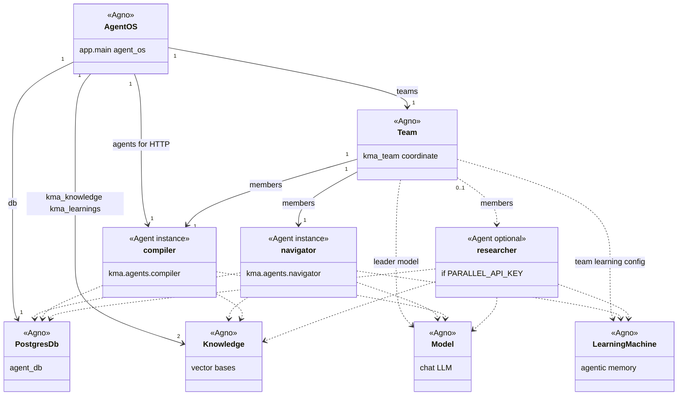

# Developer practices

## Local PostgreSQL (Docker Compose only)

The database service in `compose.yaml` is named `agent-db` (image `agnohq/pgvector:18`). To start **only** that container from the repository root:

```bash
docker compose up -d agent-db
```

Compose reads `.env` when present. Postgres is published on the host as **`POSTGRES_PUBLISH_PORT` → `5432` inside the container** (default host port `5432`). See `compose.yaml` under `agent-db.ports`. This is separate from **`DB_PORT`**, which `kma.db.build_db_url()` uses when your app or pytest connects to the database. Keep **`DB_PORT` equal to `POSTGRES_PUBLISH_PORT`** when you run tests on the host against the Compose database.

If port `5432` is already in use on your machine, set for example `POSTGRES_PUBLISH_PORT=5433` in `.env` and set **`DB_HOST=localhost`** and **`DB_PORT=5433`** for local runs and unit tests.

To stop just that service:

```bash
docker compose stop agent-db
```

### Where data lives

Postgres uses the Compose **named volume** declared as `km-agent-postgres` in `compose.yaml` (mounted at `/var/lib/postgresql` in the container). Docker registers it under a **project-scoped name**, usually `<compose_project_name>_km-agent-postgres`. The default project name is the directory name (for example `km-agent`), so the volume often appears as **`km-agent_km-agent-postgres`**. Confirm with:

```bash
docker volume ls
docker volume inspect "$(docker volume ls -q --filter name=km-agent-postgres)"
```

**On disk:** With **Docker Engine on Linux**, `Mountpoint` from `docker volume inspect` is a real host path (typically under `/var/lib/docker/volumes/.../_data`). With **Docker Desktop** (macOS or Windows), that path lives **inside Docker’s Linux VM**, not next to your project folder; you normally access the data only through Postgres or by running a one-off container that mounts the same volume (for example `docker run --rm -v km-agent_km-agent-postgres:/v alpine ls /v` — adjust the volume name to match `docker volume ls`).

### Keeping data between sessions

Named volumes **persist until you remove them explicitly**. They are **not** tied to a running container.

| Action | Postgres data |
|--------|----------------|
| `docker compose stop agent-db` or `docker compose stop` | **Kept** |
| `docker compose start agent-db` | Reattaches the **same** volume |
| `docker compose down` | Containers removed; volume **still kept** |
| `docker compose up -d agent-db` after `down` | **Same** volume is reused |
| `docker compose down -v` | Volume **deleted** (fresh empty DB on next `up`) |
| `docker volume rm <volume_name>` | Volume **deleted** |

To wipe the database and start clean:

```bash
docker compose down -v
docker compose up -d agent-db
```

## Ollama (native on the host)

**Ollama is not run in Docker Compose.** Models and binaries live in the default Ollama locations on your machine (for example `~/.ollama` on macOS/Linux). The **`km-agent`** service in `compose.yaml` talks to the host via **`OLLAMA_HOST`**, defaulting to `http://host.docker.internal:11434` so the container can reach a server bound on the host.

### Bootstrap CLI (`scripts/setup.sh`)

From the repo root, `setup.sh` downloads `compose.yaml`, ensures Docker is available, and **installs the Ollama CLI** when it is missing (official `https://ollama.com/install.sh`). Set **`SKIP_OLLAMA_INSTALL=1`** to skip the installer (for example in automation that only refreshes Compose).

### Start the server (`scripts/starter.sh`)

In a **separate terminal**, leave the Ollama API running while you develop or run integration tests. The same script first ensures **Postgres (`agent-db`)** is up via `docker compose` when `compose.yaml` is present and Docker is available:

```bash
./scripts/starter.sh
```

If something is already listening on `http://127.0.0.1:${OLLAMA_PORT:-11434}/api/tags`, the script exits without starting a second server. Override the port with **`OLLAMA_PORT`** (and keep `OLLAMA_HOST` consistent in `.env` / clients).

Pull at least one **chat** model before using the Compiler or integration tests, for example:

```bash
ollama pull qwen2.5:3b
```

**Embeddings:** `kma.db.create_knowledge` uses **`build_default_embedder()`** from `KMA_EMBED_PROVIDER`: **`ollama`** (Agno `OllamaEmbedder` with `KMA_EMBED_MODEL` / `KMA_EMBED_DIMENSIONS`, defaults `nomic-embed-text:latest` / `768`) or **`openai`** (`OpenAIEmbedder`, defaults `text-embedding-3-small` / `1536`, requires `OPENAI_API_KEY`). Pull the Ollama embedding model when using Ollama:

```bash
ollama pull nomic-embed-text:latest
```

If you previously used a different embedding size in Postgres, drop the old `kma_knowledge` / `kma_learnings` vector tables or use a fresh database volume so vector dimensions match the configured embedder.

## Frontend (Vue + Vite)

The chat UI lives under **`src/frontend`**. It is a **Vue 3** single-page app built with **Vite**, using **Vue Router** for routing and **Vitest** (Node environment) for small unit tests. It talks to **Agno AgentOS** over HTTP: the dev server proxies **`/agent-os`** to the backend so the browser can use same-origin requests and avoid CORS during local development.

### Directory layout

| Path | Purpose |
|------|---------|
| `index.html` | HTML shell; loads `/src/main.js`. |
| `vite.config.js` | Vite + Vue plugin, `@` alias, dev server port, `/agent-os` proxy target. |
| `vitest.config.js` | Test runner config (mirrors the `@` → `src` alias). |
| `src/main.js` | App bootstrap: Vue app, router, global styles. |
| `src/App.vue` | Root layout; renders `<router-view />`. |
| `src/router/index.js` | Routes (currently `/` → `ChatView`). |
| `src/views/ChatView.vue` | Main chat page: sidebar, chat panel, optional “back to docs” header. |
| `src/components/` | Reusable UI (`SessionSidebar.vue`, `KmChatPanel.vue`). |
| `src/services/agentOs.js` | AgentOS client: `fetch` to **`/agent-os/...`**, JSON helpers, SSE streaming for agent runs. |
| `src/utils/` | Shared helpers (for example SSE parsing) and their tests. |
| `src/assets/main.css` | Global styles. |

Imports can use the **`@/`** alias as a shortcut for **`src/`** (configured in both Vite and Vitest).

### How the dev proxy works

In the browser, all API calls use the prefix **`/agent-os`** (see `src/services/agentOs.js`). Vite’s dev server rewrites that to the real AgentOS HTTP API:

- **Path:** requests to `http://<vite-host>:<port>/agent-os/agents` are proxied to `{target}/agents` (the `/agent-os` prefix is stripped).
- **Target:** `VITE_AGENT_OS_ORIGIN`, or if unset **`AGENT_OS_ORIGIN`**, or default **`http://127.0.0.1:8000`**. This is read in `vite.config.js` via `loadEnv` from env files and the shell environment when you run `npm run dev`.

So the UI never needs a hard-coded backend origin in client code for local dev: align the proxy target with wherever AgentOS listens (see `scripts/dev_agent_os.sh`, which exports `VITE_AGENT_OS_ORIGIN` from `AGENT_OS_PORT` by default).

### Environment and `.env`

Create **`src/frontend/.env`** (or `.env.local`, etc.) from **`src/frontend/.env.example`**. Vite loads these from the **frontend directory** (`process.cwd()` when you run `npm run dev` inside `src/frontend`).

| Variable | Where it applies | Notes |
|----------|------------------|--------|
| `VITE_AGENT_OS_ORIGIN` | Vite config (proxy target only) | Backend base URL for the `/agent-os` proxy. Not exposed to client bundle as `import.meta.env`; the app uses relative `/agent-os` URLs. |
| `AGENT_OS_ORIGIN` | Vite config (fallback) | Same role as `VITE_AGENT_OS_ORIGIN` if the `VITE_` form is unset. |
| `VITE_PORT` | Vite dev server | Dev server port; default **`5174`** if unset. |
| `VITE_STATIC_SITE_URL` | Client (`import.meta.env`) | If set to a non-empty string, `ChatView` shows a top bar link (e.g. MkDocs or static studies site). If unset or empty, the bar is hidden. |
| `VITE_STATIC_SITE_LABEL` | Client | Label for that link; default **`Back to studies`** if unset or empty. |

Only variables prefixed with **`VITE_`** are available in application code via **`import.meta.env`**. The proxy target variables are consumed at build/config time in `vite.config.js`.

### Running the UI locally

From **`src/frontend`** after `npm ci` (or `npm install`):

```bash
npm run dev
```

From the **repository root**, `./scripts/dev_agent_os.sh` starts AgentOS in the background, sets **`VITE_AGENT_OS_ORIGIN`** to match **`AGENT_OS_PORT`** (default `8000`), waits for **`GET /agents`**, then runs **`npm run dev`** in `src/frontend`. Use **`SKIP_FRONTEND=1`** for backend only. See comments at the top of `scripts/dev_agent_os.sh` for `AGENT_OS_HOST`, `AGENT_OS_PORT`, and `VITE_PORT`.

Other npm scripts: **`npm run build`** (production bundle), **`npm run preview`** (serve the built app), **`npm run test`** (Vitest).

## Application and KMA architecture

The ASGI app in **`src/app/main.py`** wires **Agno AgentOS** to shared **Postgres** session storage, **Knowledge** vector stores, a coordinating **Team** (`kma_team` in `src/kma/team.py`), and a separate **Agent** entry for the **Compiler** so it can be invoked directly over HTTP as well as inside the team. Types named **Agent**, **Team**, **Knowledge**, **PostgresDb**, **Model**, and **LearningMachine** come from the **Agno** library; the diagram treats **`navigator`**, **`compiler`**, and **`researcher`** as the concrete `Agent` instances built in `src/kma/agents/`.

Shared **`agent_db`**, **`kma_knowledge`**, and **`kma_learnings`** are created in **`src/kma/agents/settings.py`** via **`kma.db.get_postgres_db`** and **`kma.db.create_knowledge`**. **`build_default_llm_model()`** in **`src/kma/llm_factory.py`** supplies the chat **Model** for each agent. Tool lists are assembled in **`src/kma/tools/builder.py`** (`build_compiler_tools`, `build_navigator_tools`, `build_researcher_tools`) and delegate to **`kma.tools.compiler_fs`**, **`kma.tools.ingest`**, **`kma.tools.wiki`**, **`kma.tools.knowledge`**, and Agno’s **`FileTools`**, **`SQLTools`**, **`ParallelTools`**, etc.



**Reading the diagram**

- **`app`** (FastAPI ASGI) is **`agent_os.get_app()`**; the Vue dev proxy talks to this app’s routes under **`/agent-os`** (see Frontend section).
- **`AgentOS`** is constructed with **`teams=[kma_team]`** and **`agents=[compiler]`**: the **Compiler** is both a **member of `kma_team`** and the only agent listed in **`agents`** so it stays reachable for direct HTTP runs as well as coordinated team work.
- **`researcher`** is **`None`** unless **`PARALLEL_API_KEY`** is set; **`kma.team.members`** is built with **`[m for m in [navigator, researcher, compiler] if m is not None]`**.
- The two **`Knowledge`** links from **`AgentOS`** are **`kma_knowledge`** and **`kma_learnings`** (pgvector-backed, from **`kma.db.create_knowledge`**).

## Unit tests

Install dependencies (once per clone or after dependency changes):

```bash
uv sync
```

Run all tests under `tests/`:

```bash
uv run pytest
```

Run only unit tests under `tests/ut/`:

```bash
uv run pytest tests/ut -v
```

Tests that talk to PostgreSQL (for example `tests/ut/test_db_public_schema.py`) use the same URL as `kma.db`. Run them on the **host** with **`DB_HOST=localhost`** (or `127.0.0.1`) — not `agent-db`, which only resolves inside the Compose network. Set **`DB_PORT`** to the same value as **`POSTGRES_PUBLISH_PORT`** from `compose.yaml` (default `5432`). Confirm the mapping with `docker compose ps` or `docker port agent-db`. If the server is not reachable, those tests **skip** instead of failing.

## Integration tests

Integration tests live under **`tests/it/`**. They call **real services** (Ollama HTTP API when the compiler or embedder uses Ollama; **OpenAI** when `KMA_EMBED_PROVIDER=openai` for embeddings). They are marked with **`@pytest.mark.integration`** (registered in `pyproject.toml` under `[tool.pytest.ini_options]` → `markers`).

### When to run them

Use them to confirm Agno works against your configured **compiler LLM** (`KMA_LLM_PROVIDER`) and **embeddings** (`KMA_EMBED_PROVIDER`)—defaults match local Ollama. They are **not** required for every commit if you do not have those services configured.

### How to run

From the repository root, after `uv sync`:

```bash
uv run pytest tests/it -m integration -v
```

Running **`uv run pytest`** or **`uv run pytest tests`** also collects `tests/it/`; those tests may **skip** (Ollama down, wrong model, insufficient RAM) or pass, depending on your machine.

### Environment variables

| Variable | Role |
|----------|------|
| `KMA_LLM_PROVIDER` | Compiler chat backend: `ollama` (default), `openai`, or `anthropic`. |
| `KMA_MODEL_ID` | Model id for the active compiler provider (optional; defaults per provider in `kma/config.py`). |
| `OLLAMA_HOST` | Base URL for Ollama when the compiler or embeddings use Ollama (default `http://127.0.0.1:11434`). |
| `OPENAI_API_KEY` | Required when `KMA_LLM_PROVIDER=openai` or `KMA_EMBED_PROVIDER=openai`. |
| `OPENAI_BASE_URL` | Optional; forwarded to OpenAI chat and OpenAI embed clients when set. |
| `ANTHROPIC_API_KEY` | Required when `KMA_LLM_PROVIDER=anthropic`. |
| `KMA_EMBED_PROVIDER` | Embeddings: `ollama` (default) or `openai`. |
| `KMA_EMBED_MODEL` | Embedding model id (Ollama) or name (OpenAI); defaults depend on `KMA_EMBED_PROVIDER`. |
| `KMA_EMBED_DIMENSIONS` | Vector length; must match the model (defaults per provider in `kma/config.py`). |
| `KMA_IT_OLLAMA_MODEL` | Optional override for **which pulled Ollama model** the compiler integration test uses for **chat** (`OllamaResponses`). If unset, the suite prefers `get_compiler_model_id()` when that id appears in `GET {OLLAMA_HOST}/api/tags` and `KMA_LLM_PROVIDER=ollama`; otherwise the first pulled model name (lexicographic). Use a **small** model if your default is too large for RAM. |
| `OLLAMA_EMBED_HOST` | Optional; Ollama embed host when `KMA_EMBED_PROVIDER=ollama`. If unset, `OLLAMA_HOST` is used (`/v1` stripped when present). |
| `KMA_IT_COMPILER` | Set to `1` to enable the **compiler agent** integration test (`tests/it/test_compiler_agent_integration.py`). Without it, that test is skipped so default `pytest tests` stays lighter. |

Model selection order for **Ollama chat** in `tests/it/conftest.py` (`ollama_model_id_for_integration`): `KMA_IT_OLLAMA_MODEL` (if listed) → `get_compiler_model_id()` when `KMA_LLM_PROVIDER=ollama` and that id is listed → first pulled model name (lexicographic).

### Compiler agent integration test

- **Module:** [`tests/it/test_compiler_agent_integration.py`](file:///Users/jerome/Documents/Code/km-agent/tests/it/test_compiler_agent_integration.py) (gated with **`KMA_IT_COMPILER=1`**).
- **Requires:** reachable Postgres (`kma.db` / `DB_*`); **chat** still uses a pulled **Ollama** model in this test (`OllamaResponses` + `ollama_model_id_for_integration`). **Embeddings:** with `KMA_EMBED_PROVIDER=ollama` (default), the configured `KMA_EMBED_MODEL` must appear in `ollama list` (`ollama_embed_model_available`). With `KMA_EMBED_PROVIDER=openai`, set **`OPENAI_API_KEY`** (the fixture skips if missing); no Ollama embed check.
- **Behavior:** builds `build_compiler_agent(..., model=OllamaResponses(...))` for chat, runs one `agent.run(...)`, then asserts manifest `compiled: true`, wiki outputs, and `wiki/index.md`.
- **Run:**

```bash
KMA_IT_COMPILER=1 uv run pytest tests/it -m integration -k compiler -v
```

### Multi-root raw and studies docs compile

The Compiler can read **multiple raw directories** (for example a studies repo `docs/` tree and `context/raw/` from the Researcher) while writing only under `context/wiki/`. Pass labeled roots to `build_compiler_agent(..., raw_roots=[("studies", Path(...)), ("ingested", context_dir / "raw")])` — see `build_compiler_tools` in `src/kma/tools/builder.py`. When more than one root exists (or the only root is not `context/raw`), file paths use `raw/<label>/...` and `read_manifest` includes `file_id` values such as `studies:sql/joins.md`.

To prepare a studies `docs/` folder in place and run the Compiler against that layout plus ingested raw:

```bash
uv run python scripts/compile_docs_folder.py /path/to/flink-studies/docs \
  --context ./context --source flink-studies --label studies
```

Use `--dry-run` or `--skip-compiler` to only refresh manifests and frontmatter. Requires Postgres and the configured compiler / embedding backends (see `example.env`).

### Skip vs failure

- **Skip** if Ollama is not reachable at `OLLAMA_HOST` when an integration check needs it (for example `ollama_tags` or Ollama embeddings). Start the server with `./scripts/starter.sh` or `ollama serve`.
- **Skip** if `KMA_EMBED_PROVIDER=openai` and **`OPENAI_API_KEY`** is unset (compiler integration embed gate).
- **Skip** if no Ollama models are returned when the test needs a pulled Ollama chat or embed model.
- **Skip** after a run if Ollama returns an error that looks like **missing model** or **insufficient system memory** for the chosen id; the skip message suggests setting `KMA_IT_OLLAMA_MODEL` to a smaller pulled model.

Failures indicate an unexpected error from the model run (assertions on `RunStatus.completed` and non-empty content).

### Adding new integration tests

1. Place modules under `tests/it/`.
2. Add **`@pytest.mark.integration`** to tests that touch external services.
3. Prefer session-scoped fixtures in `tests/it/conftest.py` for expensive checks (for example API reachability) so one skip short-circuits the whole session consistently.
4. Keep tests **focused** (one concern per test). The **compiler** integration test runs a full `Agent` with sandbox `context_dir` and dedicated `kma_knowledge_it` tables; enable it only with **`KMA_IT_COMPILER=1`** (see above).
