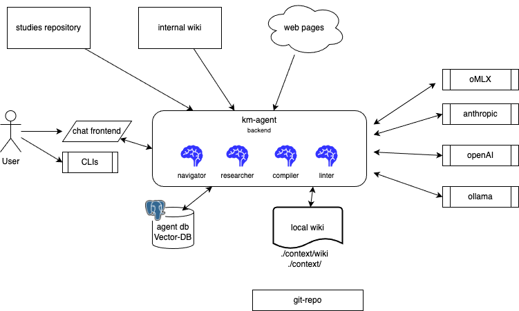

# User guide

This document is for user leveraging `km-agent` for day to day knowledge management activities: what to install, how to bring the stack up, and how to run the different **use cases**. 

Technical deep dives (Postgres volumes, integration tests, frontend proxy details) live in [`DEVELOPER_PRACTICES.md`](./DEVELOPER_PRACTICES.md). Product and architecture background are in [`SPEC.md`](./SPEC.md).

## Components View

The following figure illustrates the components involved in the solution:

<figure markdown='span'>
{ width=800 }
</figure>
* User interacts with CLIs and chat interface to the backend system, file system and external systems.
* Knowledge can come from existing notes in markdown format, but will be created and compiled in wiki folder, with concept, indexing and ontology.
* Solution interacts with local or Frontier LLMs via agents
* User preferences, embeddings and learning collection are saved to database

## What you need to get started

Be sure to have:

- Docker engine or Mac contrainer (Tahoe version)
- curl
- git cli

As most of the user interaction depends on the km-agent repository, it needs to be cloned. It includes the agent definitions and a set of tools to manage knowledge:

* clone the repository to km-agent
  ```sh
  git clone https://github.com/jbcodeforce/km-agent
  cd km-agent
  ```

## Use Cases

In this section we present the high level use cases and workflow a user can follow. 

### UC-1 Work on a new studies repository to build knowledge

Once the km-agent repository is cloned, you can add content from the web or create your own notes as markdown files under the context/raw folder and perform deep research to enhance the knowledge content and build a body of knowledge on a given domain.

The steps are:

1. Create a folder at the same level as km-agent folder for managing your domain specific knowledge. As a supporting example we will use environment engineering studies.
  ```sh
  mkdir env-eng-studies
  cd env-eng-studies
  mkdir docs
  ```
1. Use the setup studies to add agentic support to help you develop your deep research and knownledge using local AI agents of researcher, document compiler and linter, and navigator/orchestrator agent to route your future queries.

  ```sh
  cd kma-agent
  # create with default
  ./scripts/setup_studies.sh ~/Documents/Code/env-eng-studies 
  # same as 
  ./scripts/setup_studies.sh ~/Documents/Code/env-eng-studies --kma-home $PWD --label env-eng-studies
  ```

1. Use one of the starter shell to run the km-agent solution:
  ```sh
  cd xxx-studies/assistant/km-agent
  # under xxxx-studies/assistants/km-agent
  ./starter_mac.sh --dev --frontend
  ```
1 Verify your configuration (before or after starting components):
  ```sh
  cd xxx-studies/assistant/km-agent
  ./verify_config.sh
  ./verify_config.sh --frontend   # also check the Vite dev server
  ```

1. Go to [http://localhost:5174/](http://localhost:5174/), set your name on the left side of as User ID, start to chat with the ageent team to do deep researches.
1. Consult the trace and the logs/kma.log file to understand what the system does

#### Example of directive sent to agents via chat conversations:

* I want to get a roadmap to learn environment engineering, using public content and training. save in the context/raw/env_engineer_roadmap.md
* Help me to build a knowledge roadmap for environment engineering and science with python
* let assume beginner level is already address, let start by searching for geospacial analysis for environment engineering. Develop a detailed plan


### Uc-2 Work from existing content

User has already a set of notes, in the form of markdown files to manage his/her own knowledge. The tool will help to build semantic search and knowledge graph as wiki and build ontology. From there is is possible to add more content via deep research as in previous section.

As in previous use case, the  km-agent should run **from inside the studies repo**. As an example we will use the [flink-studies](https://github.com/jbcodeforce/flink-studies) repository which includes a lot of documentations for Apache Flink and Confluent Cloud and code. 

1. From the **km-agent** repository:
  ```bash
  ./scripts/setup_studies.sh /path/to/flink-studies --kma-home $PWD --label flink
  ```
  This creates `assistants/km-agent/` with `context/`, `example.env`, `.env`, `.kma-home`, and wrapper scripts. Edit `assistants/km-agent/.env` for LLM keys and ports. The setup uses a dedicated Postgres container name and port (`5433` by default) so it does not clash with a km-agent repo running on `5432`.

1. Start the backend, frontend servers
  ```bash
  cd /path/to/flink-studies
  ./assistants/km-agent/starter_mac.sh --dev --frontend
  ```

1. Verify the configuration
  ```bash
  ./assistants/km-agent/verify_config.sh
  ```

1. The documents need to have a frontmatter in each markdown file.  This can be run as many time as needed, when new files are added. 
  ```bash
  ./assistants/km-agent/add_raw_frontmatter.sh --check
  ```
1. Compile studies docs into the wiki
  ```bash
  ./assistants/km-agent/compile_docs_folder.sh
  ./assistants/km-agent/compile_docs_folder.sh --dry-run   # preview only
  ```

---
TBC

Other pipeline wrappers (same directory): `index_wiki.sh`, `index_studies_code.sh`, `build_ontology.sh`, `run_search.sh`.

Output lands under the studies `KMA_CONTEXT_DIR` wiki (typically `assistants/km-agent/context/wiki/`). Sources stay under studies `docs/` and `context/raw/`; compile state is tracked in the single shared `context/.manifest.json` (entries use `file_id` like `flink:architecture/foo.md` or `ingested:notes.md`).


See also `assistants/km-agent/README.md` in the studies repo after setup.

---

## Use cases

### UC-1 Add annotation to sources file(s)

*Goal:** The source knowledge may not have the frontmatter manifest in each markdown file, and it is needed for metadata managment of the wiki.

* Files that already have km-agent raw frontmatter get a manifest sync only (no rewrite unless --force).
* When specifying a directory, it crawls **/*.md, skips excluded dirs, and updates the shared `context/.manifest.json` with `file_id` values like `studies:sub/needs.md`.
* Files with non-km YAML frontmatter are skipped unless --force.
* Batch runs print a summary line at the end.

#### Preconditions

* python and uv available.

#### Steps (outline)

```sh
# Audit only — report which files have frontmatter (exit 1 if any are missing)
uv run python scripts/add_raw_frontmatter.py /path/to/docs --check

# Single file (unchanged behavior)
uv run python scripts/add_raw_frontmatter.py path/to/doc.md --source flink-studies
# Crawl a folder — adds frontmatter to files missing it, updates manifest with relative paths
mkdir  /path/to/docs --source flink-studies
```


### UC-2 — Attach a studies repository and compile and lint documentation into the wiki

**Goal:** From an existing Markdown tree (for example a `docs/` folder of the [flink-studies](https://github.com/jbcodeforce/flink-studies)), update a tracking manifest entries, and run the **Compiler** and **linter** agents so **`context/wiki/`** gains summaries, concept pages, and an updated **`index.md`**.

#### Preconditions

- Postgres running; LLM and embedder configured (`KMA_LLM_PROVIDER`, `KMA_EMBED_*`).
- OMLX server (or cloud) models pulled for chat.
- Embedding model will be pulled on the first calls
- Input files have frontmatter information

**Studies-hosted layout:** If you used [`setup_studies.sh`](https://github.com/jbcodeforce/km-agent/tree/main/scripts/setup_studies.sh), start the stack with `./assistants/km-agent/starter_mac.sh --dev --frontend` and compile with `./assistants/km-agent/compile_docs_folder.sh` from the studies repo root. Context is under `KMA_CONTEXT_DIR` (typically `docs/context/`).

#### Steps (outline)

**Option A — from km-agent repo:**

1. From the km-agent repo folder, run the crawler and knowledge Compiler agent:

   ```bash
   uv run python scripts/compile_docs_folder.py /path/to/docs \
     --context ./context  --label studies
   ```

   Use `--dry-run` or `--skip-compiler` to only prepare manifests and front matter without invoking the agent.

   Unchanged docs are skipped when their content SHA-256 matches the `sha256` stored for that `file_id` in `context/.manifest.json`. Edit a file or pass `--recompile` to force the Compiler again.

**Option B — studies-hosted layout:**

1. From the studies repo:

   ```bash
   ./assistants/km-agent/compile_docs_folder.sh
   ```

2. Inspect `docs/context/wiki/index.md` and `docs/context/wiki/concepts/` after a successful run (paths follow `KMA_CONTEXT_DIR`).

**Success:** Processed sources move to **compiled** (with `sha256` recorded on the shared context manifest), and the wiki index reflects new or updated articles. Unchanged files are left alone on later runs.

### UC-2b — Catalog studies code into the wiki (intent summaries)

**Goal:** From a studies repo **`code/`** (or **`src/`**) tree—for example [flink-studies](https://github.com/jbcodeforce/flink-studies) `code/`—write one wiki concept page per top-level category (`flink-sql`, `dbt`, …) with short **LLM intent** blurbs and `code:` path references so chat search can find demos.

#### Preconditions

- LLM configured (`KMA_LLM_PROVIDER`, …). Use `--no-llm` for README-only blurbs without a model.
- `--studies-root` or `KMA_STUDIES_ROOT` pointing at the studies clone.

#### Steps

```bash
uv run python scripts/index_studies_code.py \
  --studies-root /path/to/flink-studies \
  --context ./context

# Embed the new wiki pages for semantic chat retrieval
uv run python scripts/index_wiki.py --context ./context
```

**Studies-hosted:** `./assistants/km-agent/index_studies_code.sh` then `./assistants/km-agent/index_wiki.sh`.

Use `--dry-run` to list categories/labs without writes; `--force` to re-summarize when packs changed little; `--limit N` for a smoke run.

**Success:** `context/wiki/concepts/code-*.md` exist, `wiki/index.md` has a **Code catalogs** section, and after `index_wiki.py` Navigator/`search_wiki` can retrieve lab intent.

### UC-3 - Build ontology

### UC-4 — Ask questions using the wiki, files, and SQL

**Goal:** Use chat to answer a question by combining the wiki index and articles, files under `context/`, structured data in the **`kma`** schema, and vector-backed knowledge where configured.

#### Preconditions

- AgentOS and (optionally) the Vue UI are running.
- You have content under `context/wiki/` and/or `context/raw/`, or populated SQL tables, depending on what you want queried.

**Steps (outline):**

1. Open the chat UI (or call AgentOS APIs).
2. Ask a **specific** question that references your domain (e.g. a concept you know exists in the wiki or a table you use).
3. For knowledge-heavy questions, the agent should consult the wiki index first, then drill into articles—see [`SPEC.md` — Context navigation](SPEC.md#2-context-navigation).
4. **Keep an answer:** use **Copy** on a completed reply to put the markdown on the clipboard, or type `/save my-notes.md` to write the latest assistant reply under `context/raw/` (YAML frontmatter + manifest; overwrites the same filename if it already exists).

**Success:** You get an answer grounded in your materials, with paths or citations you can verify under `context/` or in the DB.

**Next (to expand):**

- Example prompts for a studies-style repo.
- How to interpret session vs agent selection in the UI.
- What to do when the answer is too generic (check wiki index, run compile, bootstrap `kma_knowledge`).

---

### UC-5 — Ingest new material from the web

**Goal:** Gather sources from the web, normalize them as markdown under **`context/raw/`** with proper front matter, and optionally hand them to the **Compiler** so the wiki stays current.

#### Preconditions

- **`PARALLEL_API_KEY`** set so the **Researcher** agent is enabled (see `example.env` and `src/kma/agents/researcher.py`).
- Same database and LLM setup as other use cases.

**Steps:**

1. Start the stack (`./scripts/starter.sh --dev --frontend`).
2. In chat (via **kma team**), ask for research on a topic — e.g. "Search news on Flink 2.2 and enrich the wiki."
3. The team leader delegates to **Researcher** (ingest to `raw/`), then **Navigator** (answer), then schedules **background compile + lint** automatically.

**Success:** New files under `context/raw/` with YAML front matter; user gets an immediate answer; wiki updates in the background (`wiki/index.md`, concepts, lint report).

**Manual compile** (if auto-compile is off): set `KMA_AUTO_COMPILE_AFTER_RESEARCH=0` or use **`compile_docs_folder.py`** / ask the Compiler agent explicitly.

**Next (to expand):**

- Example multi-turn conversation for “research topic Y”.
- Parallel vs stub ingest when the API key is missing.
- How manifests merge for multi-root layouts (`raw/studies/...` vs `raw/ingested/...`).

---

### UC-6 — Incremental compile after editing raw notes

**Goal:** After you add or edit markdown in **`context/raw/`**, refresh only **uncompiled** entries and avoid rewriting the whole wiki.

#### Preconditions

- Existing manifest (`.manifest.json` under the relevant raw root) understands your files.
- Compiler tools and model access unchanged.

**Steps (outline):**

1. Edit or add a raw document; ensure front matter includes **`compiled: false`** when you want recompilation (see [`SPEC.md` — Knowledge base pipeline](SPEC.md#1-knowledge-base-pipeline)).
2. Ask the team or the Compiler agent to process uncompiled files, or use the batch script if your sources live in an external `docs/` tree (UC-2).

**Success:** Only changed sources drive new or updated wiki pages; `wiki/index.md` and `.state.json` stay consistent.

**Next (to expand):**

- Manifest field reference and `file_id` with labelled roots.
- How to force a full recompile safely (if ever needed).

---

## Contributing to this guide

When you add or refine a use case:

1. Keep **Goal → Preconditions → Steps → Success → Next** so readers can skim.
2. Link to **`SPEC.md`** or **`DEVELOPER_PRACTICES.md`** instead of duplicating long environment tables.
3. Use real commands and paths where possible; mark placeholders like `/path/to/your-studies/docs` clearly.
