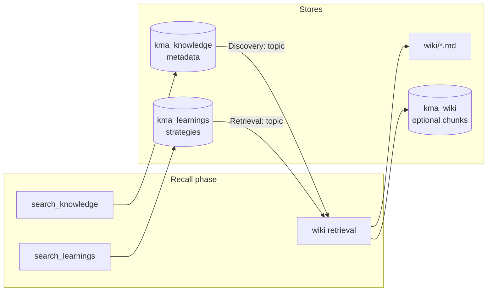

# Wiki as RAG: architecture decisions

???- info "version"
    - Created 02/2026
    - Update with new refactoring 07/2026
    
This document explains how **Knowledge**, **Learnings**, and **Wiki** relate, and when to use the wiki index versus vector embeddings for retrieval.

For pipeline overview and agent roles, see [`SPEC.md`](./SPEC.md).

## Three context systems (not three copies of the same thing)

| System | Where it lives | What it stores | Analogy |
|--------|----------------|----------------|---------|
| **Knowledge** (`kma_knowledge`) | pgvector table | Routing metadata only — file locations, SQL schemas, source capabilities, cross-source discoveries | The map |
| **Learnings** (`kma_learnings`) | pgvector table | Operational memory — retrieval strategies, user patterns, explicit corrections | The compass |
| **Wiki** (`context/wiki/`) | Git-tracked markdown (+ optional `kma_wiki` vectors) | Domain content — compiled concepts, source summaries, filed outputs | The territory |
| **Ontology** (`context/ontology/`) | Git-tracked TTL + JSON (derived) | Formal typed graph — concepts, provenance, code artifacts, optional inferred closure | The formal map |

See [`ONTOLOGY.md`](./ONTOLOGY.md) for build commands and agent tools.

### Knowledge — the map

- **Purpose:** Tell the agent *where* to look, not *what* the answer is.
- **Content:** Short metadata entries with prefixed titles: `File:`, `Schema:`, `Source:`, `Discovery:`, `Wiki:`, `Raw:`.
- **Constraint:** Never store raw article bodies here. Violating this duplicates wiki content and blurs routing with retrieval.
- **Population:** Bootstrap via `context/load_context.py`; agents append discoveries after successful multi-source queries.
- **Search:** Hybrid vector + keyword over metadata (`search_knowledge` on agents with `search_knowledge=True`).

### Learnings — the compass

- **Purpose:** Remember *how* retrieval worked for this user and *what* they corrected.
- **Content:** Prefixed entries: `Retrieval:`, `Pattern:`, `Correction:`.
- **Priority:** `Correction:` always wins over older learnings.
- **Population:** Agno `LearningMachine` (agentic mode on Navigator) plus explicit `save_learning` calls.
- **Search:** `search_learnings` during the Recall phase.
- **Not domain knowledge:** Learnings do not replace wiki articles. A learning like "for join questions, start with wiki/concepts/flink-sql-joins" is routing strategy, not Flink documentation.

### Wiki — the territory

- **Purpose:** Hold the actual compiled domain knowledge the user cares about.
- **Content:** Concept articles, per-source summaries, filed query outputs, plus a master catalog.
- **Population:** Compiler agent (raw/docs → wiki), Navigator (outputs/), Linter (health reports).
- **Retrieval:** Index-first file reads; optional semantic search over embedded chunks (see below).



## Wiki catalog files (not the same as embeddings)

The wiki directory exposes two different index artifacts:

| File | Role | Article routing? |
|------|------|------------------|
| `wiki/index.md` | Master catalog — every article with a one-line summary, tags, wikilink | **Yes** — primary routing surface |
| `wiki/.state.json` | Operational metadata — last compile/lint time, article counts | **No** — health/timestamp only |

There is no separate `index.json` today. If you need machine-readable routing, derive it from `index.md` frontmatter and section structure, or add a generated `index.json` at compile time. **`.state.json` cannot substitute for an article index** — it does not list paths, summaries, or tags.

Design intent (from SPEC): at ~100 articles, `index.md` fits in a single LLM read (~5K tokens). The Navigator scans summaries and selects articles to `read_file`.

## Two wiki retrieval modes

### Mode A — Index-first (default, no embedding step)

```
read_wiki_index → read_file(wiki/concepts/...) → raw/ via manifest → live sources
```

- Works immediately after compile; no Postgres embed pass required.
- Matches the core constraint: **navigation over search** — each source keeps its native interface; the wiki index *is* the native interface for article selection.
- Best when the wiki is small enough that the full index fits in context and article titles/summaries match user vocabulary.

Tools: `read_wiki_index`, `read_file`, `read_manifest`.

### Mode B — Semantic recall (optional, offline embed)

```
search_wiki → read_file(selected paths) → index-first fallback
```

- Requires `./scripts/index_wiki.py` (or `index_wiki.sh` in flink-studies) to chunk and embed wiki markdown into `kma_wiki`.
- Uses hybrid pgvector search over **content chunks**, not just index lines.
- Best when:
  - The wiki outgrows a single index read.
  - Queries use different wording than index summaries (semantic match).
  - You want chunk-level recall before committing to a full article read.

Tools: `search_wiki` (returns excerpts + `wiki_path`), then `read_file` for full articles.

Current Navigator priority (see `WIKI_INSTRUCTIONS` in `src/kma/agents/instructions.py`):

1. `search_wiki` — when offline indexing has run
2. `read_wiki_index` + targeted `read_file`
3. `raw/` via manifest
4. Live sources (Exa, etc.)

## Index versus embeddings: decision guide

| Question | Prefer index-first | Prefer embeddings (`kma_wiki`) |
|----------|-------------------|----------------------------------|
| Wiki size | Under ~100 articles; index fits in one read | Hundreds+ articles or index exceeds context budget |
| Query style | User terms match index titles/tags | Paraphrase, vague, or cross-cutting questions |
| Ops cost | Minimize — compile only, no embed job | Accept offline embed after each compile |
| Freshness | Immediate after compile (no re-embed lag) | Re-run `index_wiki.py` after wiki changes |
| Explainability | Clear path: index line → article file | Chunk excerpts; may need `read_file` for full context |

**Recommendation:** Treat index-first as the baseline. Add `kma_wiki` embeddings when measurement shows index-only recall failing (missed articles, index too large, or repeated full index reads burning tokens).

For a given domain studies local expert chat, embedding is documented as a second phase after compile — not a hard prerequisite for chat.

## Research → raw → wiki refresh (team workflow)

When chat runs through the **kma team** (`POST /teams/kma/runs`), research and enrichment requests follow:

```
User → Team leader → Researcher (ingest raw/) → Navigator (answer) → user
                              └→ trigger_wiki_refresh (background: compile each file → lint)
```

- **User-facing latency:** Researcher + Navigator only; compile and lint do not block the response.
- **Compile then lint:** Background job compiles each new raw file sequentially, then runs the linter once.
- **Toggle:** `KMA_AUTO_COMPILE_AFTER_RESEARCH=0` disables automatic background refresh.

After background compile completes, re-run `./assistants/index_wiki.sh` in flink-studies if semantic `search_wiki` is enabled.

## How Knowledge relates to Wiki (avoid duplication)

| Action | Correct store | Example |
|--------|---------------|---------|
| Compiler produced `wiki/concepts/apache-flink.md` | Wiki file + optional `update_knowledge("Wiki: concepts/apache-flink.md", "tags: ...")` | Metadata pointer only |
| User asks about changelog mode | Read wiki article | Content stays in markdown |
| Agent learns "Flink join questions → start with 04-joins wiki + docs/flink-sql/04-joins" | `save_learning("Retrieval: flink joins", "...")` | Strategy, not article body |
| Agent finds answer spans wiki + SQL notes + a file | `update_knowledge("Discovery: flink joins", "wiki/concepts/..., File: ...")` | Cross-source routing |

`kma_wiki` embeddings hold **chunked article text** for semantic search. `kma_knowledge` holds **pointers and discoveries**. They serve different layers of the same retrieval stack.

## Summary

- **Knowledge** = where things are (map).
- **Learnings** = what worked and what the user fixed (compass).
- **Wiki** = what the domain says (territory).
- **`.state.json`** = compile health, not an article index.
- **`index.md`** = the designed routing catalog; embeddings are an optional accelerator when the catalog alone is insufficient.
