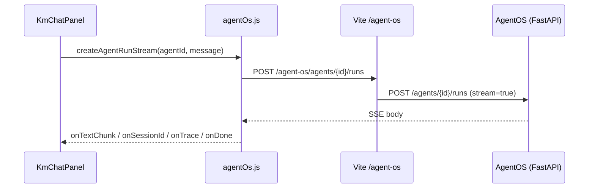

# KM Agent — Frontend

Vue 3 single-page app that talks to **AgentOS** (Agno) over HTTP. It lists chat sessions, loads history, and streams assistant replies via Server-Sent Events (SSE).

## Stack

| Piece | Role |
|-------|------|
| Vue 3 + `<script setup>` | UI components |
| Vue Router | Single route (`/`) with `user_id` and `session_id` query params |
| Vite 6 | Dev server, build, `@` path alias |
| Vitest | Unit tests for SSE parsing and trace formatting |

## Layout

```
src/frontend/
├── index.html              # Mount point
├── vite.config.js          # Dev proxy: /agent-os → AgentOS origin
├── src/
│   ├── main.js             # App bootstrap
│   ├── App.vue             # Router outlet shell
│   ├── router/index.js     # Routes and document title
│   ├── views/ChatView.vue  # Shell: sidebar + chat, agent discovery
│   ├── components/
│   │   ├── SessionSidebar.vue   # Session list, user id, pagination
│   │   └── KmChatPanel.vue      # Messages, streaming run, trace panel
│   ├── services/agentOs.js      # AgentOS REST + SSE client
│   └── utils/sseParse.js        # SSE block parsing
```

## Request flow



Session list and history use JSON endpoints (`listSessions`, `getSession`) on the same `/agent-os` prefix.

## Development

From this directory:

```bash
npm install
npm run dev      # default http://localhost:5174
npm run build    # production assets
npm run test     # vitest
```

Start the backend (AgentOS) separately; see repository root `README.md` and `docs/DEVELOPER_PRACTICES.md`.

Copy `.env.example` to `.env` and adjust:

| Variable | Purpose |
|----------|---------|
| `VITE_AGENT_OS_ORIGIN` | Upstream for Vite proxy (default `http://127.0.0.1:8000`) |
| `KMA_VITE_PORT` / `VITE_PORT` | Dev server port (default `5174`) |
| `VITE_STATIC_SITE_URL` | Optional “back to docs” link in `ChatView` header |
| `VITE_STATIC_SITE_LABEL` | Label for that link |

The browser never calls AgentOS directly in dev: all API traffic goes to `/agent-os`, which Vite rewrites to the configured origin.

## URL state

| Query param | Behavior |
|-------------|----------|
| `user_id` | Scopes sessions and runs; persisted in `localStorage` (`km_agno_user_id`) |
| `session_id` | Loads `chat_history` into the panel; updated when a new run returns a session id |

“New chat” clears `session_id` while keeping `user_id`.

## Key modules

- **`services/agentOs.js`** — `listAgents`, `listSessions`, `getSession`, `createAgentRunStream`, `consumeAgentRunSse`, `formatTraceLine`, `chatHistoryToMessages`, `pickAgentId`.
- **`utils/sseParse.js`** — `parseOneSseBlock`, `effectiveEventName` for Agno run events.
- **`views/ChatView.vue`** — Resolves default agent id on mount, wires sidebar and chat panel.
- **`components/KmChatPanel.vue`** — Streaming UI, markdown-ish rendering, optional activity trace.
- **`components/SessionSidebar.vue`** — Paginated session list; exposes `refreshList()` after a run completes.

## Tests

- `src/utils/sseParse.test.js` — SSE line parsing
- `src/services/agentOs.trace.test.js` — Trace line formatting for tool/reasoning/model events

Run with `npm test`.
